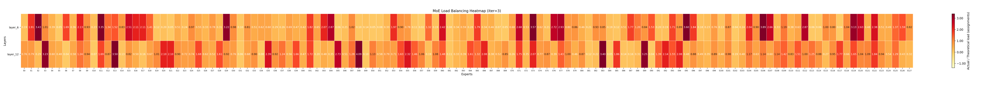

# MOE-Patch 🔍 

**MOE-Patch** 是一个专为 MoE 模型设计的深度监测工具。它通过 **Monkey Patch** 机制，在不侵入原始训练或推理框架（如 `verl`, `ms-swift` , `vllm`等）源码的前提下，实时捕获并分析路由分布、专家负载、Token 丢弃率等关键指标。

## 📝 更新日志

[v0.1.0] - 2025-02-03 (v1版本)**"v1版本发布"**


## ✨ 核心特性

- **即插即用**：基于 Monkey Patch 技术，适配LLM训练和推理流程。
- **多维指标**：
    - **Load Balance**: 相对负载均衡
    - **Importance Sampling weight**: 重要性采样权重
- **可视化**：支持绘制负载均衡热力分布

## 🚀 快速上手

### 统计
无需修改直接带着patch代码训练或者推理

#### ms-swift
ms-swift 已通过 pip 安装时：

```bash
export PYTHONPATH="src/patch/swift:$PYTHONPATH"
export MOE_PATCH_DIR="logs/moe_monitor"
```

若你直接使用 ms-swift 仓库源码（未 pip 安装），则同时把 ms-swift 仓库根目录也加入：

```bash
export PYTHONPATH="src/patch/swift:path/to/ms-swift:$PYTHONPATH"
export MOE_PATCH_DIR="logs/moe_monitor"
```

变量说明：
- `MOE_PATCH_DIR`：输出目录。
  - 每个 rank 写一个文件：`$MOE_PATCH_DIR/swift_moe_lb_step_all_rank_{rank}.jsonl`
- `SWIFT_MOE_MONITOR_INTERVAL`：每隔多少个 iteration 记录一次（默认 `1`）。
- `SWIFT_MOE_MONITOR_COUNT_MODE`：计数时机（默认 `no_grad`）。
  - `no_grad`：只在 `torch.no_grad()` 下计数（适配 activation recompute，避免重复计数；常见于 `--recompute_granularity full`）。
  - `grad`：只在 `torch.enable_grad()` 下计数（适用于未开启 recompute 的训练）。
  - `all`：无条件计数。

未设置 `MOE_PATCH_DIR` 则监控不启用。

#### verl
```bash
#routed expert record dir
export MOE_PATCH_DIR="path/to/moe_patch_dir"     
#patched code dir
export VERL_PATCH_PATH="path/to/moe_patch/src/patch/verl"  
export RAY_PYTHONPATH="${VERL_PATCH_PATH}:${PYTHONPATH:-}"
export PYTHONPATH=$RAY_PYTHONPATH                         
export VERL_APPLY_PATCHES=actor_routed_expert_capturer_v3  # apply 的 补丁文件

### 多机
RUN_TIME_CONFIG=(
    "+ray_kwargs.ray_init.runtime_env.py_modules=['$VERL_PATCH_PATH']"
    "+ray_kwargs.ray_init.runtime_env.env_vars.MOE_PATCH_DIR=$MOE_PATCH_DIR"
    "+ray_kwargs.ray_init.runtime_env.env_vars.VERL_APPLY_PATCHES=actor_routed_expert_capturer_v3"
    "+ray_kwargs.ray_init.runtime_env.env_vars.PYTHONPATH='$RAY_PYTHONPATH:\$PYTHONPATH'"
)

python3 -m verl.trainer.main_ppo \ 
    xx
    "${RUN_TIME_CONFIG[@]}" \
    xx
```

```python
# 在 https://github.com/verl-project/verl/blob/main/verl/workers/megatron_workers.py ,末尾添加


# 在 https://github.com/verl-project/verl/blob/e5f5ea6620dbe0409617fe1643f390974017bb87/verl/trainer/ppo/ray_trainer.py#L1605 后添加

```

#### 输出示例
```json
{
  "iteration": 1200,
  "rank": 0,
  "layer": "layer_6",
  "num_experts": 4,
  "top_k": 2,
  "tokens": 2048,
  "actual_assignments": [800, 965, 1150, 1181]
}
```

### 可视化
visual_moe_patch.py 支持单实验可视化和多实验对比两种模式。

#### 单实验模式

示例：

```bash
# 只看某个 iteration，读取指定目录下的所有 jsonl 文件
python src/visual_moe_patch.py logs/moe_monitor --iter 1200 --out heatmap_iter1200.png

# 不指定 iteration，默认将所有记录按 token 数加权平均
python src/visual_moe_patch.py logs/moe_monitor

# 只看特定的 layers（按索引或名称）
python src/visual_moe_patch.py logs/moe_monitor --iter 1200 --layers 6 12 18
```

#### 多实验对比模式

使用 `--exp` 参数可以同时对比多个实验的热力图，方便比较不同训练配置的 MoE 负载分布。

示例：

```bash
# 对比 3 个实验在 iter 1200 时特定 layers 的负载分布
python /absolute/path/to/moe_monitor_patch/plot_moe_heatmap.py \
  --exp baseline:/path/to/logs/moe_monitor_baseline \
  --exp aux_loss:/path/to/logs/moe_monitor_aux_loss \
  --exp expert_choice:/path/to/logs/moe_monitor_expert_choice \
  --iter 1200 \
  --layers 6 12 \
  --out comparison_iter1200.png
```

常用参数：

- `log_dir`（位置参数）：单实验模式下的日志目录，会自动读取 `*.jsonl`。
- `--exp name:/path/to/logs`：多实验对比模式，格式为 `实验名称:日志路径`，可重复多次指定不同实验。
- `--iter`：按照 iteration 过滤；不指定则聚合所有记录。
- `--layer`：过滤特定的层，支持层名称（如 `layer_6`）或索引（如 `6`）。
- `--out`：输出图片路径（默认：`moe_heatmap.png`）。




## 🤝 贡献与反馈
如果你在特定的 MoE 架构上遇到适配问题，欢迎提交 [Issue](https://github.com/your-username/expertlens/issues)。

## 📄 开源协议
本项目基于 [Apache-2.0](LICENSE) 协议开源。